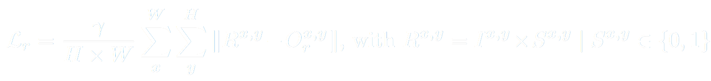

# X-Caps
Official Code Repository for X-Caps: Diagnosis Capsule Network for Interpretable Medical Image Diagnosis
----

Paper by [Rodney LaLonde](https://rodneylalonde.wixsite.com/personal), [Drew Torigian](https://www.med.upenn.edu/apps/faculty/index.php/g334/p15574), and [Ulas Bagci](http://www.cs.ucf.edu/~bagci/).

This paper was accepted for publication at **MICCAI 2020** (23rd International Conference on Medical Image Computing and Computer Assisted Intervention) as an **oral publication** and **awarded with the MICCAI Student Travel Award for best student papers**. 

The original paper can be found at MICCAI 2020 or [arXiV](https://arxiv.org/abs/1909.05926).

##Motivation for Explainable Diagnosis
Convolutional neural network (CNN) based systems have largely not adopted into clinical workflows. This hesitancy is seen in many high-risk applications (e.g., healthcare, military, security, transportation, finance, legal). The reluctance of adoption is cited as lack of trust, caused by the highly uninterpretable “black-box” nature of CNNs.

DARPA has invested billions over the past few years in “explainable” AI. Transportation Department wants XAI in self-driving cars. Patent & Trademark Office wants XAI for improving its patent approval process. Elham Tabassi, acting chief of staff at the National Institute of Standards and Technology (NIST) Information Technology Lab, and the lead author of the NIST report on a common set of AI principles, said this…
"We need them to be explainable, rather than just give an answer. They should be able to explain how they derive that prediction or to that decision… That goes a long way on increasing trust in the system."

###Explainable vs. Interpretable
In the context of this work, interpretability deals with the post-hoc analysis of the inner workings of a model in relation to its predictions, such as Grad-CAM and saliency maps or blacking out parts of the input to see how it changes the output. Explainable methods on the other hand explicitly provide explanations for their predictions when making them. The argument for explainable predictions over post-hoc interpretations is this: Instead of a model predicting a picture is of a cat, and a researcher trying to break down the neural activation patterns of what parts of the image are activating which parts of the network, what end-users would really prefer, is for the model to explain its predictions just as a human would. We call this human-level explainability. When asking why is this a cat, a human would not vaguely point to regions of the image, or parts of their brain, they would answer...

it’s a cat, because it has fur, and whiskers, and claws, etc. Humans explain their classifications of objects based on a taxonomy of object attributes, and if we want our models to be explainable at the human level, they should provide end-users with these same kinds of explanations. 

##Research Question
Can we build a capsule network to model specific visually-interpretable object attributes & form predictions based solely on their combination?

###Explainable Lung Cancer Diagnosis
As an application of this research we chose lung cancer diagnosis. Lung cancer is a perfect application within medical imaging diagnosis, because radiologists already explain their predictions for nodule malignancy, based on a taxonomy of attributes, including subtlety, sphereicity, margin, lobulation, spiculation, and texture.

##An Explainable Multi-Task Capsule Network (X-Caps)

.")

To solve this problem, we propose an explainable multi-task capsule network. An object, in this case a lung nodule, is input to  our three-layer 2D capsule network to form attribute prediction capsule vectors. Each of these vectors is supervised to encode a specific visually-interpretable attribute of the target object, where the dimensions of each vector capture the possible variations of that attribute over the dataset, and the magnitude of the vector represents the attribute presence, or in our case its score. Then, we predict the nodule’s malignancy by passing these visually-interpretable capsules through a linear function and apply a softmax activation to create a probability distribution over malignancy scores, while also passing them to a reconstruction branch to perform regularization. For creating these attribute capsules, unlike in CapsNet where parent capsules were mutually-exclusive (for example if class prediction is the digit 5 it cannot also be a 3), our parent capsules are not mutually-exclusive of each other, where a nodule can score high or low in each of the attribute categories. For this reason, we modify the dynamic routing algorithm to independently route information from children to parents through a “routing sigmoid” function:

Where the original “routing softmax” employed by CapsNet enforces a one-hot mapping of information from each child to parents, our proposed routing sigmoid learns a non-mutually-exclusive relationship between children and parents to allow multiple children to be emphasized for each parent, while the rest of the dynamic routing procedure following the same as in CapsNet.

###Building-in Confidence Estimation
Typically, in lung nodule classification datasets, a minimum of three radiologists provide their scores on a scale of one to five for nodule malignancy. Previous studies in this area follow a strategy of averaging radiologists’ scores and then attempt to either regress this average or perform binary classification as above or below three. However, such approaches throw away valuable information about the agreement or disagreement amongst experts. To better model the uncertainty inherently present in the labels due to inter-observer variation, we propose to directly predict the distribution of radiologists’ scores by fitting a Gaussian function to the mean and variance as the ground-truth for our classification vector. This allows us to model the uncertainty present in radiologists’ labels and provide a meaningful confidence metric at test time to radiologists. Nodules with strong inter-observer agreement will produce a sharp peak as the ground-truth during training, in which case predictions with large variance (i.e. low confidence) will be punished. Likewise, for nodules with poor inter-observer agreement, we expect our network to output a more spread distribution and will be punished for strongly predicting a single class label, even if correct. At test, the variance in the predicted distribution provides radiologists with an estimate of the model’s confidence in that prediction. 

###Multi-Task Loss Formulation
X-Caps, being a multi-task framework, has 3 losses in its overall objective function. First, for the reconstruction branch, we choose to reconstruct only the nodule region of the input, masked by the ground-truth segmentation, then we compute the mean-squared error between this and the reconstruction branch output. 

Next, for our 6 attribute predictions, we compute the mean-squared error between the network predictions and the normalized mean of radiologist scores for each attribute. 

Lastly, for predicting malignancy, we compute the KL Divergence between a Gaussian distribution fit to the mean and variance of radiologist scores, and the softmax over our malignancy output prediction vector. 

The total loss is the sum of these three loss functions. 

For simplicity we choose to set the loss balancing coefficients to 1 for all terms except the reconstruction branch, which was set to 0.5 to prevent over-regularizing the network. It’s worth noting briefly that engineering efforts spent to carefully tune these parameters, could lead to superior performance.

##Experiments and Results
We performed experiments on the LIDC dataset, where at least 3 radiologists annotated 646 benign and 503 malignant nodules, excluding nodules of mean malignancy score exactly 3. Our method was compared against the state-of-the-art explainable CNN for lung cancer diagnosis, called HSCNN, which is a deep, dense, dual-path, 3D CNN, as well as two non-explainable 3D CNNs and the original CapsNet. The results of our experiments show, that supervising the attributes learned within the vectors of our capsule network significantly improved our performance over CapsNet, while a CNN-based method which built an identical explainable hierarchy of first predicting attributes then malignancy suffered from degraded performance compared to its non-explainable counterparts, as shown in the symbolic plot at the top of this blog. Here are the quantitative results of our experiments, where our simple 2D, 3-layer, X-Caps significantly outperformed the explainable HSCNN on predicting attribute scores, while also achieving higher malignancy prediction accuracy, with performance comparable to that of the non-explainable, deep, multi-crop or multi-scale 3D CNNs. 

##Conclusions and Discussion
Available studies for explaining DL models, typically focus on post hoc interpretations of trained networks, rather than attempting to build-in explainability. This is the first study for directly learning an interpretable feature space by encoding high-level visual attributes within the vectors of a capsule network to perform explainable image-based diagnosis. We approximate visually-interpretable attributes through individual capsule types, then predict malignancy scores directly based only on these high-level attribute capsule vectors, in order to provide malignancy predictions with explanations at the human-level, in the same language used by radiologists. Our proposed multi-task explainable capsule network, X-Caps, successfully approximated visual attribute scores better than the previous state-of-the-art explainable diagnosis system, while also achieving higher diagnostic accuracy. We hope our work can provide radiologists with malignancy predictions which are explained via the same high-level visual attributes they currently use, while also providing a meaningful confidence metric to advise when the results can be more trusted, thus allowing radiologists to quickly interpret and verify our predictions. Lastly, we believe our approach should be applicable to any image-based classification task where high-level attribute information is available to provide explanations about the final prediction.

#Instructions for Running the Code

First run the `getting_started_script.py` to convert the LIDC-IDRI dataset into the proper format (make sure to set the `--data_root_dir` argument to where you have the LIDC-IDRI dataset stored on your system.)

After that, just run `main.py` again making sure to set the `--data_root_dir` argument to where you have the LIDC-IDRI dataset stored on your system. That should be it!

There are a ton of optional arguments you can checkout within `main.py`. Each of them have a `help` to describe what they do.

If you have any questions or issues, feel free to email me at lalonde@Knights.ucf.edu.